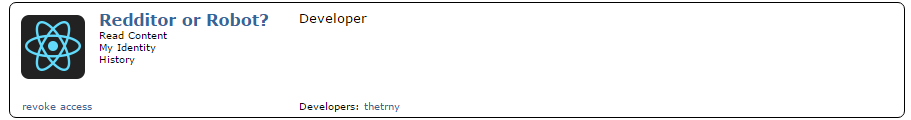

# [Redditor or Robot?](https://tsitu.github.io/Redditor-or-Robot/) &middot; 

## Introduction

'Redditor or Robot?' is a Reddit API-based game in which players put their bot-sniffing skills to the test. A random subreddit and its corresponding [/r/SubredditSimulator](https://www.reddit.com/r/SubredditSimulator/comments/3g9ioz/what_is_rsubredditsimulator/) user are selected from this [list](https://github.com/tsitu/Redditor-or-Robot/blob/master/src/utils/ssbotlist.js) and it's up to you to figure out whether the displayed comment was written by a human... or a bot!

*Note:* The dev branch of this repo is privatized for security and accessibility. As such, you will not be able to clone and build this project locally. However, all of the core implementation details have been included for viewing.

## Gameplay

The current subreddit is reloaded when you guess incorrectly or after you've successfully identified 10 consecutive users. 3 mistakes and it's game over!

In the interest of simplicity, a bot is defined as one that comments solely on /r/SubredditSimulator. If you encounter a bot masquerading as a human, please submit an [issue](https://github.com/tsitu/Redditor-or-Robot/issues/new) so it can be added to this [list](https://github.com/tsitu/Redditor-or-Robot/blob/master/src/utils/commonbotlist.js).

## OAuth2

The Reddit API OAuth2 scopes required by this game are as follows:
* [identity](https://www.reddit.com/dev/api/oauth#scope_identity) (to fetch your username)
* [read](https://www.reddit.com/dev/api/oauth#scope_read) (to fetch a subreddit's Hot posts)
* [history](https://www.reddit.com/dev/api/oauth#scope_history) (to fetch comments from a /r/SubredditSimulator bot)

## Revoking Access

If, for any reason, you need to completely clear out the permissions for this game:

1. Make sure you're logged out.
2. Navigate [here](https://www.reddit.com/prefs/apps) and scroll down until you find "Redditor or Robot?"
3. Click "revoke access" in the bottom left. It should look similar to the image below.

## Technologies

* [React](https://github.com/facebook/react#readme)
* [Webpack](https://github.com/webpack/webpack#readme)
* [Babel](https://github.com/babel/babel#readme)
* [snoowrap](https://github.com/not-an-aardvark/snoowrap#readme)
